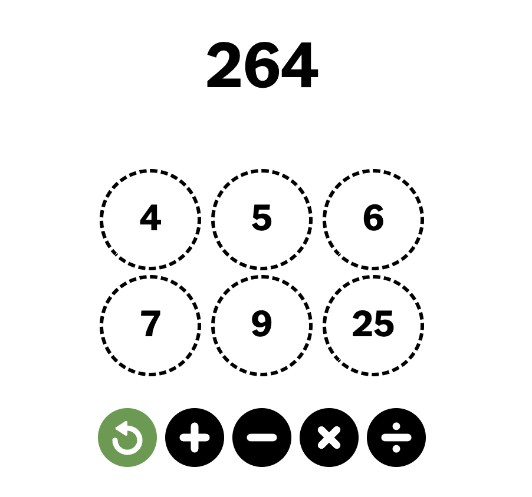

# `DigitsSolver`
Solve *New York Times* [digits puzzles](https://www.nytimes.com/games/digits).

For example, here is how to solve this puzzle:

<p align="center">
    
</p>

```
julia> using DigitsSolver

julia> digits_solver(264, [4,5,6,7,9,25])
[4, 5, 6, 7, 9, 25] → 25 + 5 = 30 → [4, 6, 7, 9, 30]
[4, 6, 7, 9, 30] → 30 × 9 = 270 → [4, 6, 7, 270]
[4, 6, 7, 270] → 270 - 6 = 264 → [4, 7, 264]
```

In case no answer exists:
```
julia> digits_solver(200,1:5)
No solution

julia> digits_solver(200,1:6)
[1, 2, 3, 4, 5, 6] → 4 + 3 = 7 → [1, 2, 5, 6, 7]
[1, 2, 5, 6, 7] → 7 × 6 = 42 → [1, 2, 5, 42]
[1, 2, 5, 42] → 42 ÷ 1 = 42 → [2, 5, 42]
[2, 5, 42] → 42 - 2 = 40 → [5, 40]
[5, 40] → 40 × 5 = 200 → [200]
```

Note that `digits_solver` can be used just with a list of arguments like this:
```
julia> digits_solver(200,1,2,3,4,5,6)
[1, 2, 3, 4, 5, 6] → 4 + 3 = 7 → [1, 2, 5, 6, 7]
[1, 2, 5, 6, 7] → 7 × 6 = 42 → [1, 2, 5, 42]
[1, 2, 5, 42] → 42 - 2 = 40 → [1, 5, 40]
[1, 5, 40] → 40 × 5 = 200 → [1, 200]
```

## Faster or shorter?

By default, `digits_solver` stops working upon finding the first possible solution. That solution
might entail more steps than necessary. If called with an optional third argument `quick_stop` 
set to `false`, then the function works harder but might find a shorter solution.
```
julia> @time digits_solver(290, 5:10)
[5, 6, 7, 8, 9, 10] → 8 × 5 = 40 → [6, 7, 9, 10, 40]
[6, 7, 9, 10, 40] → 40 × 9 = 360 → [6, 7, 10, 360]
[6, 7, 10, 360] → 10 × 7 = 70 → [6, 70, 360]
[6, 70, 360] → 360 - 70 = 290 → [6, 290]
  0.017439 seconds (115.70 k allocations: 7.792 MiB)

julia> @time digits_solver(290, 5:10, false)
[5, 6, 7, 8, 9, 10] → 8 × 5 = 40 → [6, 7, 9, 10, 40]
[6, 7, 9, 10, 40] → 40 × 7 = 280 → [6, 9, 10, 280]
[6, 9, 10, 280] → 280 + 10 = 290 → [6, 9, 290]
  1.353365 seconds (7.93 M allocations: 370.520 MiB, 11.99% gc time)
```

Here is a more extreme example:
```
julia> @time digits_solver(289, 5:11)
[5, 6, 7, 8, 9, 10, 11] → 10 × 8 = 80 → [5, 6, 7, 9, 11, 80]
[5, 6, 7, 9, 11, 80] → 11 - 7 = 4 → [4, 5, 6, 9, 80]
[4, 5, 6, 9, 80] → 80 - 9 = 71 → [4, 5, 6, 71]
[4, 5, 6, 71] → 71 × 4 = 284 → [5, 6, 284]
[5, 6, 284] → 284 + 5 = 289 → [6, 289]
  0.015777 seconds (66.25 k allocations: 5.397 MiB)

julia> @time digits_solver(289, 5:11, false)
[5, 6, 7, 8, 9, 10, 11] → 10 + 7 = 17 → [5, 6, 8, 9, 11, 17]
[5, 6, 8, 9, 11, 17] → 11 + 6 = 17 → [5, 8, 9, 17, 17]
[5, 8, 9, 17, 17] → 17 × 17 = 289 → [5, 8, 9, 289]
205.565965 seconds (252.44 M allocations: 10.645 GiB, 1.46% gc time)
```

> **WARNING** 
>
>Note that `digits_solver(a,b,c,d,false)` is not equivalent to `digits_solver(a,[b,c,d],false)` because `false` becomes a zero, and so the code run will be `digits_solver(a,b,c,d,0)`, which is not what's intended. Similarly, `digits_solver(a,b,c,d,true)` executes `digits_solver(a,[b,c,d,1])`.
```
julia> digits_solver(10,3,4,5,true)
[1, 3, 4, 5] → 5 + 4 = 9 → [1, 3, 9]
[1, 3, 9] → 9 + 1 = 10 → [3, 10]

julia> digits_solver(10,[3,4,5],true)
No solution
```


## Twenty Four game 

See also [this code](https://github.com/scheinerman/TwentyFour.jl) for solving Twenty Four cards. They are very similar to these puzzles.
